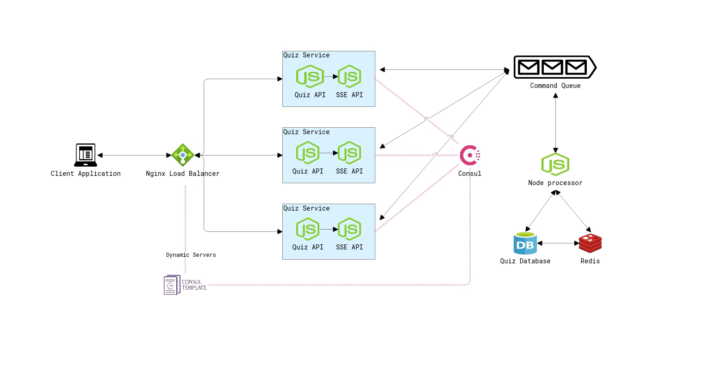
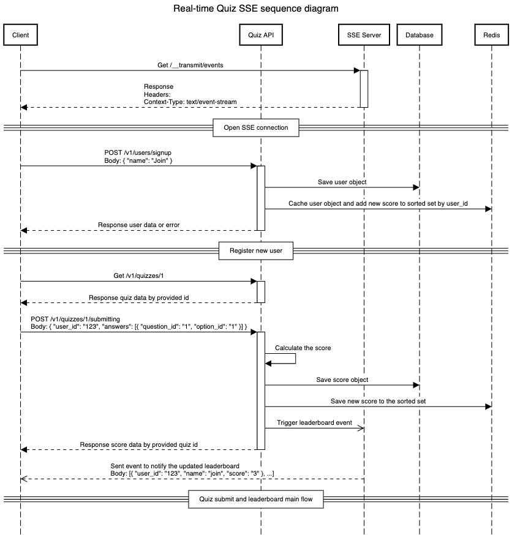

# Real-Time Vocabulary Quiz Coding Challenge

## Architecture Diagram



### Why Sever-sent events (SSE)

In normally, we would use WebSockets for real-time communication, but SSE is a more suitable choice here because SSE is a standard API, which means it's easy to implement, deployment and maintain.

**Cons**:

- SSE is not supported by older browsers. But we can use polyfill as well.

### Why Consul

Consul is a service discovery and configuration management tool. It helps to manage services and their dependencies, which makes it easier to scale and maintain a system.

I use Consul to manage the quiz services and make nginx dynamic upstream with Consul-template to automatically update Nginx.

### Why Redis

Redis is an in-memory data store that can be used as a database, message broker, or cache.

In this case, I use Redis to cache the user's info and the scores in a sorted set for performance leaderboard.

**Cons**:

- Potential data inconsistency

### Monitoring and Observability

I used Prometheus for metrics collection and storage and Grafana for visualization.

## Data Flow



- Step 1: client will send a request to the server to start open a SSE connection on startup.
- Step 2: register a new user
- Step 3: client will send a request to the server to start a new quiz
- Step 4: client submit a quiz
- Step 5: server will send the quiz leaderboard to the client over SSE connection.

## How to run

- Clone this repo
- In the root directory, run:
  ```cmd
  pnpm i
  pnpm run test # to run the tests
  pnpm run dev # to run the dev server
  ```
- Go to the link `localhost:3333/docs` for the swagger documentation.

## What todos

- Setup docker-compose to totally explain the whole system
